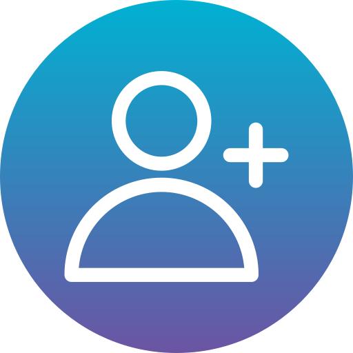

# Agenda telefónica

## Descripción

Esta aplicación representa una agenda telefónica de contactos. Al abrirla por primera vez contiene una serie de contactos por defecto que sirven como ejemplo. Estos contactos pueden ser editados o directamente eliminados. También es posible añadir nuevos contactos, que tendrán los campos *Nombre* y *Teléfono*.

## Funcionamiento

Los contactos de esta agenda aparecen mostrados en pantalla en una tabla. En caso de que se produzca desbordamiento, aparecerá una barra de desplazamiento en ella para poder ver todo su contenido.

La aplicación cuenta con cuatro botones que, mediante iconos, representan las posibilidades que ofrece la aplicación.

   

### Añadir contacto

El primer botón sirve para añadir un nuevo contacto a la agenda. Al pulsarlo, aparecerá una nueva ventana con dos cajas de texto para definir *Nombre* y *Teléfono*. También tendrá dos botones: uno para confirmar y guardar los cambios y otro para cancelar la operación.

La ventana *Añadir contacto* no permite que ninguna de sus dos cajas de texto estén vacías. Tampoco permite que el campo *Teléfono* tenga caracteres que no sean numéricos. Además, estos números deben tener nueve dígitos obligatoriamente. Por último, se comprueba que ni el nombre ni el teléfono estén ya registrados en otro registro de la tabla de contactos.

El botón de *Confirmar* valida los datos y, si son correctos, los incorpora al listado de contactos. Si no lo son, aparece un mensaje de aviso indicando qué requisito no se cumple, permitiendo volver a intentar la operación.

Al pulsar el botón de *Cancelar*, la operación queda anulada. La ventana *Añadir contacto* se cierra directamente.

### Editar contacto

El segundo botón hace que, cuando tengamos seleccionado un contacto de la tabla, aparezca una nueva ventana que permite cambiar los datos. Si al pulsarlo no hay ningún contacto seleccionado, aparecerá un mensaje de aviso.

La ventana *Editar contacto* tiene dos cajas de texto: *Nombre* y *Teléfono*, que aparecerán con el texto original de su respectivo registro. En ella podemos realizar los cambios deseados en uno o en ambos campos. 

Cuando se pulsa el botón de *Confirmar*, se comprueba que ninguna de las cajas esté vacía, que no exista ningún contacto con el mismo nombre o con el mismo teléfono y que el teléfono solo tenga nueve caracteres numéricos. Si se cumplen los requisitos, los datos del registro que se había seleccionado serán cambiados por los nuevos datos introducidos.

El botón *Cancelar* descarta todos los cambios realizados, cerrando la ventana *Editar contacto* y dejando el contacto seleccionado con los mismos datos que tenía previamente.

## Eliminar contacto

El tercer botón elimina el registro de la tabla seleccionado. En el caso de que no se haya seleccionado ningún contacto, aparecerá un mensaje de aviso indicando que debemos seleccionar una fila de la tabla.

## Guardar

El último botón guarda el contenido de la tabla de contactos en un archivo interno de la agenda. Al cerrar la aplicación y volver a abrirla más tarde se cargarán todos los contactos que había en la tabla cuando pulsamos este botón.

## Versiones

En el desarrollo de este proyecto se han creado tres versiones diferentes de la agenda de contactos, una por cada miembro del grupo. Cada una de las versiones cuenta con una interfaz diferente, aunque el funcionamiento es similar. Se ha optado por esta versión debido a su principal diferencia: incorporar el guardado del contenido de la agenda. A continuación podemos observar las otras dos versiones.

## Lenguajes utilizados

Para elaborar este proyecto se han utilizado los siguientes lenguajes:

- Java
- Swing

## Autores

Este proyecto ha sido desarrollado como parte de la asignatura *Desarrollo de interfaces* del Grado Superior *Diseño de Aplicaciones Multiplataforma* en *UNIR FP*. Los componentes del *Grupo 9* son:

- Elvira Medina Velilla
- María Moreno Rodríguez
- Álvaro Tercero Nieves

